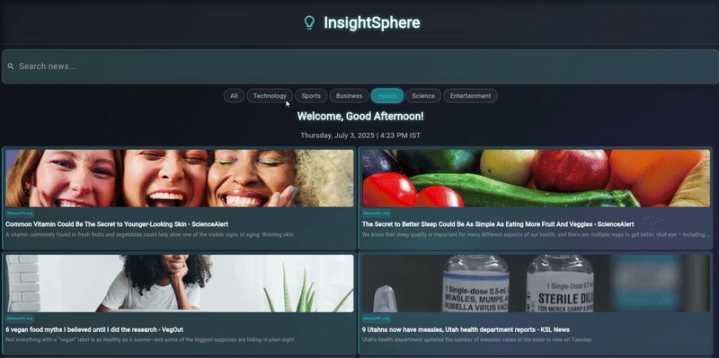
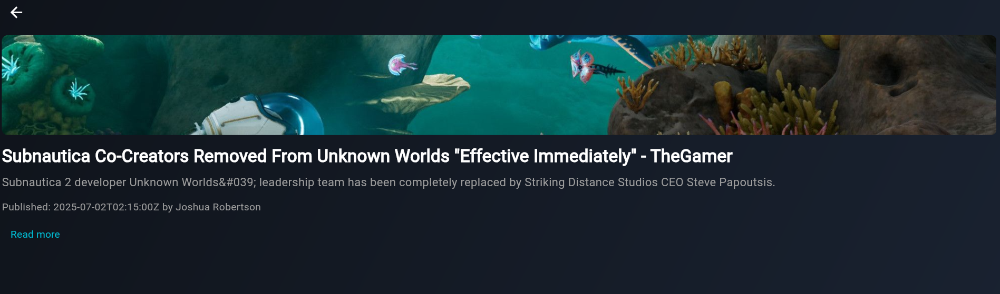

<h1 align="center">
  📰 Flutter News Hub App
</h1>

<p align="center">
  
</p>


<p align="center">
  
  
  
</p>
<h3 align="center">
  🗞️ Stay Updated • 📲 Read Trending News • 🌐 Explore the World Through Headlines
</h3>

<p align="center">
  
</p>

---

## 🧠 About the App

> "Your daily dose of news — clean, beautiful, and lightning fast."

This elegant and minimal **Flutter News Hub App** lets users:

- 🔍 Browse current headlines and top articles
- 📄 Dive deep into full articles using WebView
- 🧠 Explore category-based clean UI
- 🚀 Load news dynamically using API calls

---

## ✨ UI Preview

<p align="center">
  
  &nbsp; &nbsp;
  
</p>

---

## 🎯 Key Features

| Feature                      | Description                                                 |
|------------------------------|-------------------------------------------------------------|
| 📡 Real-time News Fetching   | REST API integration using `http` package                  |
| 🌐 External Links & Sharing  | Open articles directly in the browser via `url_launcher`   |
| 🧭 Smooth Navigation          | Structured routing: Home → Article                         |
| 📰 Modern UI Design           | Custom fonts, SVGs, gradients, and animations              |
| 💨 Shimmer Loading Effects    | Ensures smooth data loading and placeholders               |
| 🌓 Dark Mode Friendly         | Built with theming in mind (extendable)

---

## 🧩 Tech Stack

| Tech/Tool            | Usage                                    |
|----------------------|------------------------------------------|
| `Flutter`            | Cross-platform mobile framework          |
| `http`               | Fetching news data from the internet     |
| `url_launcher`       | Launching URLs from within the app       |
| `flutter_svg`        | Rendering SVG icons                      |
| `shimmer`            | Loading animation placeholders           |
| `google_fonts`       | Beautiful typography                     |

---

## 🖼️ Screenshots

| 🏠 Home Screen | 📰 Article Page |
|----------------|----------------|
|  |  |

---

**Adarsh Kumar**  
💡 *CSE | Data Science | Flutter & UI Enthusiast*  
📫 **Email:** [adarshsingh6534@gmail.com](mailto:adarshsingh6534@gmail.com)  
🔗 **Links:**  
[](https://github.com/Adarsh-Kumar6534)
[](https://www.linkedin.com/in/adarsh65/)


## 🛠 How to Run

```bash
git clone https://github.com/Adarsh-Kumar6534/flutter-news-hub.git
cd flutter-news-hub
flutter pub get
flutter run
## 🙋‍♂️ Author

